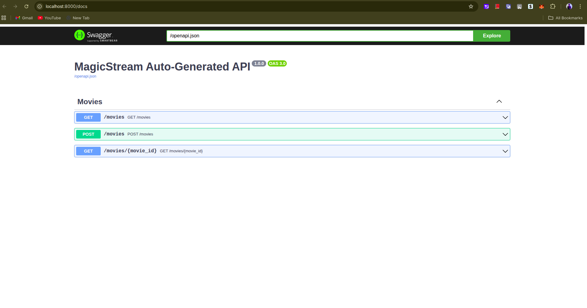

# Fastapify



Fastapify is a minimalist Go module built on top of [Gin](https://gin-gonic.com/) that provides automatic request/response binding and OpenAPI (Swagger) documentation generation. It simplifies routing by using generic handlers to automatically bind JSON bodies and URI parameters.

## Installation

```bash
go get github.com/sharathcx/fastapify@v0.1.0
```

## Setup & Example Usage

Here is a complete example of setting up a CRUD API for managing "Users" using Fastapify. 

### 1. Define your Models

```go
package controllers

type User struct {
	ID    int    `json:"id" uri:"id"`
	Name  string `json:"name" binding:"required"`
	Email string `json:"email" binding:"required"`
}

type CreateUserReq struct {
	Name  string `json:"name" binding:"required"`
	Email string `json:"email" binding:"required"`
}

type UpdateUserReq struct {
	Name  string `json:"name"`
	Email string `json:"email"`
}

type UserIdReq struct {
	ID int `uri:"id" binding:"required"`
}
```

### 2. Create the Controller Handlers

Fastapify handlers take a `*gin.Context` and a pointer to your defined Request struct, and return a pointer to your Response struct and an `error`.

```go
package controllers

import (
	"github.com/gin-gonic/gin"
	"github.com/sharathcx/fastapify"
)

var users = []User{
	{ID: 1, Name: "John Doe", Email: "john@example.com"},
}
var nextID = 2

// GetUser - GET /users/{id}
func GetUser(c *gin.Context, req *UserIdReq) (*User, error) {
	for _, u := range users {
		if u.ID == req.ID {
			return &u, nil
		}
	}
	// Return a structured error using fastapify.NewApiError
	return nil, fastapify.NewApiError(404, "User not found", fastapify.ErrNotFound, nil)
}

// CreateUser - POST /users
func CreateUser(c *gin.Context, req *CreateUserReq) (*User, error) {
	newUser := User{
		ID:    nextID,
		Name:  req.Name,
		Email: req.Email,
	}
	users = append(users, newUser)
	nextID++
	return &newUser, nil
}

// UpdateUser - PUT /users/{id}
// Notice how we can combine URI params (ID) and JSON Body params in a single struct
type UpdateReqCombined struct {
	ID    int    `uri:"id" binding:"required"` // from URI
	Name  string `json:"name"`                 // from JSON body
	Email string `json:"email"`                // from JSON body
}

func UpdateUser(c *gin.Context, req *UpdateReqCombined) (*User, error) {
	for i, u := range users {
		if u.ID == req.ID {
			if req.Name != "" {
				users[i].Name = req.Name
			}
			if req.Email != "" {
				users[i].Email = req.Email
			}
			return &users[i], nil
		}
	}
	return nil, fastapify.NewApiError(404, "User not found", fastapify.ErrNotFound, nil)
}

// DeleteUser - DELETE /users/{id}
func DeleteUser(c *gin.Context, req *UserIdReq) (*struct{}, error) {
	for i, u := range users {
		if u.ID == req.ID {
			users = append(users[:i], users[i+1:]...)
			return nil, nil // Return nil for success with no body
		}
	}
	return nil, fastapify.NewApiError(404, "User not found", fastapify.ErrNotFound, nil)
}
```

### 3. Register Routes in Main

Now, wrap your Gin router with `fastapify.New()` and use the typed routing functions (`fastapify.Get`, `fastapify.Post`, etc.).

```go
package main

import (
	"log"
	"github.com/gin-gonic/gin"
	"github.com/sharathcx/fastapify"
	"yourproject/controllers"
)

func main() {
	r := gin.Default()
	app := fastapify.New(r)

	// Register Routes
	fastapify.Get(app, "/users/{id}", controllers.GetUser)
	fastapify.Post(app, "/users", controllers.CreateUser)
	fastapify.Put(app, "/users/{id}", controllers.UpdateUser)
	fastapify.Delete(app, "/users/{id}", controllers.DeleteUser)

	// Setup Swagger UI
	// This will generate docs at /openapi.json and serve the UI at /docs
	app.SetupSwagger("/openapi.json")

	log.Println("Server running on http://localhost:8080")
	log.Println("Swagger docs available at http://localhost:8080/docs")
	r.Run(":8080")
}
```

## Error Handling & Responses

Fastapify automatically wraps your successful responses in a standard `ApiResponse` structure, which looks like this:

```json
{
  "statusCode": 200,
  "data": { ... },
  "message": "Success",
  "success": true,
  "code": "SUCCESS"
}
```

If you return an `error` from your handler, it handles validation errors and standard errors by automatically generating a consistent JSON response. You can also return structured HTTP errors using `fastapify.NewApiError`:

```go
return nil, fastapify.NewApiError(404, "Item not found", fastapify.ErrNotFound, nil)
```

Which produces:

```json
{
  "success": false,
  "code": "NOT_FOUND",
  "message": "Item not found",
  "errors": null
}
```

## Features

- **Generic Handlers:** No need to manually write `c.ShouldBindJSON` or `c.ShouldBindUri`. Just define your structs and Fastapify handles the rest.
- **Auto Swagger Generation:** Fastapify inspects your structs and automatically builds an OpenAPI 3.0 specification.
- **Standardized Error Handling:** Consistent `ApiResponse` and `ApiError` shapes applied automatically to every endpoint.
